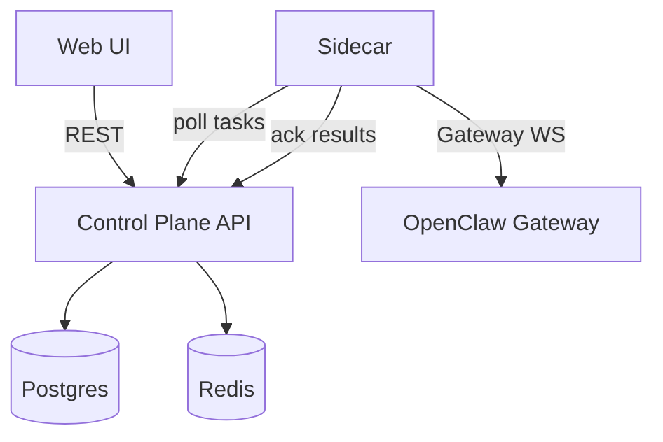

# OpenClaw Fleet Control Plane

[中文说明](README.zh-CN.md)

Control plane + sidecar architecture for managing multiple OpenClaw instances without modifying OpenClaw core.

## Architecture



### Components

- **Control Plane (API + UI)**: Fastify service that stores state, dispatches tasks, and serves the web UI.
- **Sidecar (per instance)**: Polls tasks and executes them by calling the local OpenClaw Gateway API.
- **OpenClaw Gateway (local)**: Sidecar connects to `ws://127.0.0.1:18789` and uses standard gateway methods.
- **Storage**: Postgres for durable state, Redis for heartbeats and leases.

### Task lifecycle

1. Task created via API/UI (`/v1/tasks`) with `pending` status.
2. Sidecar polls `/v1/tasks/pull`, lease is recorded in Redis, task becomes `leased`.
3. Sidecar executes the action via the Gateway and sends `/v1/tasks/ack`.
4. Control plane writes `task_attempts` and moves status to `done` or `failed`.

## Supported Features (Current)

- Enrollment + device token auth
- Heartbeats + online status
- Task dispatch + retries + attempt history
- Actions:
  - `agent.run`
  - `session.reset`
  - `memory.replace`
  - `skills.update`
  - `skills.install`
  - `skills.status` (snapshot per instance)
  - `config.patch`
- UI:
  - Instances list + online status
  - Tasks list + task detail (attempts + error)
  - Skills snapshot + enable/disable
  - Memory/Persona editor
  - Per-instance OpenClaw console link (`control_ui_url`)

## Quick Start

```bash
pnpm install
cp .env.example .env
pnpm build
pnpm ui:build
node --env-file=.env dist/index.js
```

UI development:

```bash
pnpm ui:dev
```

## Environment

- `PORT`: server port (default 3000)
- `DATABASE_URL`: Postgres connection string
- `REDIS_URL`: Redis connection string
- `ENROLLMENT_SECRET`: shared enrollment secret

## Migrations

Run all SQL files in `migrations/` against your Postgres database:

- `migrations/001_init.sql`
- `migrations/002_instance_task_metadata.sql`

## API

See `docs/api.md` for endpoints and payloads.

UI-related read endpoints:
- `GET /v1/instances`
- `GET /v1/instances/:id`
- `PATCH /v1/instances/:id`
- `GET /v1/instances/:id/skills`
- `GET /v1/tasks`
- `GET /v1/tasks/:id`
- `GET /v1/tasks/:id/attempts`

## Sidecar

See `docs/sidecar.md` for sidecar configuration and usage.

## Cloud Deploy

See `docs/cloud-deploy.md` for a single-host cloud deployment and test flow.

## Roadmap

- Group/label based task dispatch
- Group and label management UI
- Audit/event stream + history filters
- Config templates and staged rollout
- RBAC / multi-tenant support
- Realtime updates (WS) instead of polling
- Fleet-wide metrics dashboard
- Signed artifacts and versioned rollouts
