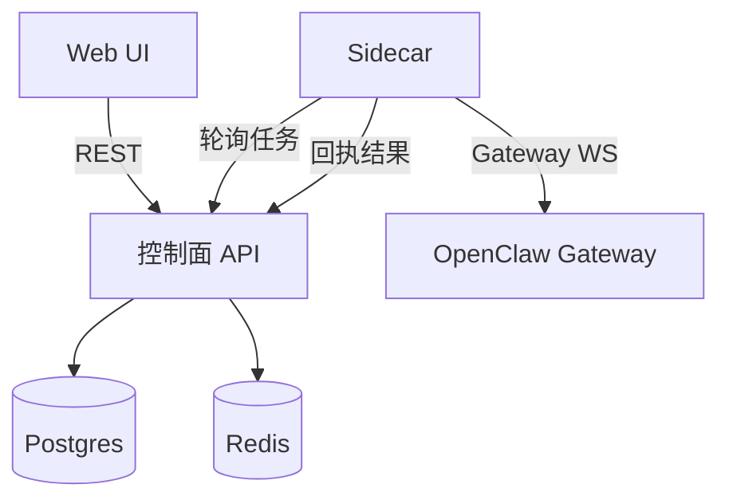

# OpenClaw Fleet 控制面

控制面 + Sidecar 架构，用于在不修改 OpenClaw 内核的前提下管理多实例。

## 架构



### 组件说明

- **控制面（API + UI）**：Fastify 服务，负责状态存储、任务下发与 Web UI。
- **Sidecar（每实例）**：拉取任务并调用本机 OpenClaw Gateway 执行。
- **OpenClaw Gateway（本地）**：Sidecar 连接 `ws://127.0.0.1:18789`。
- **存储**：Postgres（持久化状态）+ Redis（心跳/租约）。

### 任务生命周期

1. API/UI 创建任务（`/v1/tasks`），状态为 `pending`。
2. Sidecar 拉取任务（`/v1/tasks/pull`），Redis 记录租约，任务变为 `leased`。
3. Sidecar 执行网关动作并提交回执（`/v1/tasks/ack`）。
4. 控制面写入 `task_attempts`，状态变为 `done` 或 `failed`。

## 已支持功能（当前）

- 注册与设备令牌认证
- 心跳上报 + 在线状态
- 任务下发 + 重试 + attempt 记录
- 支持的动作：
  - `agent.run`
  - `session.reset`
  - `memory.replace`
  - `skills.update`
  - `skills.install`
  - `skills.status`（实例技能快照）
  - `config.patch`
- UI：
  - 实例列表与在线状态
  - 任务列表与详情（attempt/error）
  - 技能快照与启停
  - Memory/Persona 编辑器
  - 实例 OpenClaw 控制台链接（`control_ui_url`）

## 快速开始

```bash
pnpm install
cp .env.example .env
pnpm build
pnpm ui:build
node --env-file=.env dist/index.js
```

UI 开发：

```bash
pnpm ui:dev
```

## 环境变量

- `PORT`: 监听端口（默认 3000）
- `DATABASE_URL`: Postgres 连接串
- `REDIS_URL`: Redis 连接串
- `ENROLLMENT_SECRET`: 注册用共享密钥

## 迁移

依次执行：

- `migrations/001_init.sql`
- `migrations/002_instance_task_metadata.sql`

## API

详细接口见 `docs/api.md`。

UI 相关只读接口：
- `GET /v1/instances`
- `GET /v1/instances/:id`
- `PATCH /v1/instances/:id`
- `GET /v1/instances/:id/skills`
- `GET /v1/tasks`
- `GET /v1/tasks/:id`
- `GET /v1/tasks/:id/attempts`

## Sidecar

参考 `docs/sidecar.md`。

## 云端部署

参考 `docs/cloud-deploy.md`。

## Roadmap

- 分组/标签下发
- 分组与标签管理 UI
- 审计/事件流与历史筛选
- 配置模板与分批发布
- 权限/RBAC 与多租户
- 从轮询升级为实时 WS 推送
- 全局指标与监控面板
- 版本化发布与制品签名
